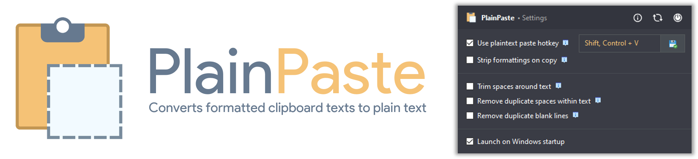

# PlainPaste
   

**PlainPaste** is a cute and lightweight Windows utility that clears all formattings from texts copied to the clipboard. It rids you off the nagging habit of pasting formatted texts in Notepad then re-paste the converted plain text to your desired application.

**Visit official page:** https://willykimura.com/plainpaste

# Features

- Clean, simple and minimalist design.
- Does its job silently from the System Tray, letting you access its settings in one click.
- Smoothly auto-closes window when done/inactive so no need to intervene.
- Dark mode support for a nice, distraction-free experience.
- Portable with very low memory footprint.
- Includes settings for saving user preferences.

*Made with* 💛 *by* [*Willy Kimura*]([https://willykimura.com/plainpaste]).